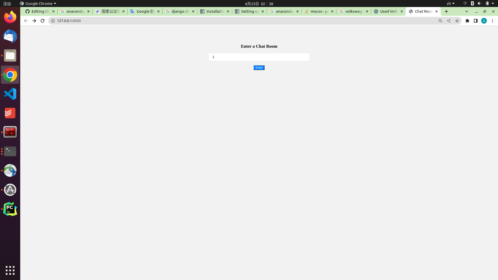
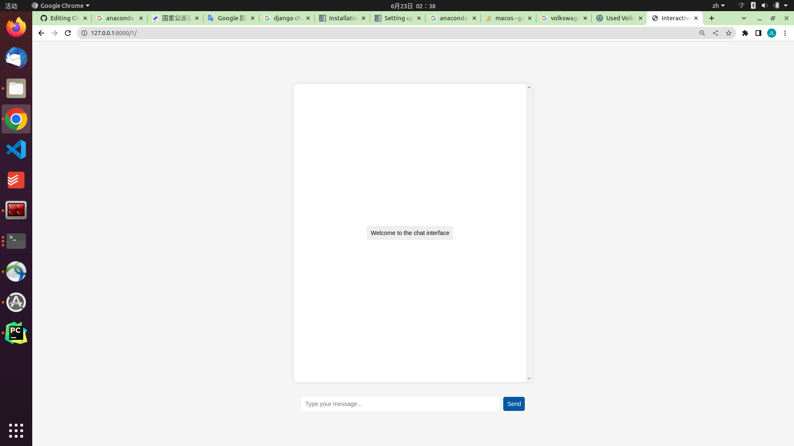

# nginx-uwsgi-daphne-django-chatgpt
## Qucik Introduction
This repo is to built a standard website. Thus, Nginx, uwsgi daphane and django are used together.
In the website testing phase, you can ignore all things except django, as those others are built for a quick response of the website, and ease the pressuare of the server when there is a huge amount of website visits.

If you are in a test phase, plz ignore the following notes:
> Technically, Nginx is the first door of web server. it is responsible for finding static files (deal with static request) in the server (imgs, css, js). And it also forwards the dynamic request to uwsgi and daphane.
> uwsgi is used for dealing with http request.
> daphane is used for dealing with websocket.
> In fact, uwsgi can also deal with websocket too, but its effeciency is lower than that of daphane.
> The configuration of them are comparabley complex. I'll complement them later. You can check https://uwsgi-docs.readthedocs.io/en/latest/tutorials/Django_and_nginx.html for a quick view.

## How to Run
You can directly start the website by using django and its own test server.
The core content for this repo is about generating response from open AI's API. The code is in the fold chatApp->gen_response.py
When you deploy this code locally, plz change the SK to your own openAI API KEY. And you can change model as your willing. Here we use gpt-3.5.

For django part, it just realizes a function of chat room by using consumers (websocket). 

For research using, the specification is as follows:
plz note, here we just use django as the test server, the configuration of nginx, uwsgi, daphane wont be introduced here.

Clone this repo and change directory to ChatDjango, where you can find manage.py.

Then you can run following codes in the terminal, plz note you should install a anaconda before everything starts.
```
conda create -n testgpt python==3.9
python -m pip install -U channels["daphne"] #django will be installed automatically.
pip install openai
python3 manage.py runserver
```
Then, go to http://127.0.0.1:8000/ in the browser and you can see following interface. Type something randomly as the room name, and enter.


Then you will move to the following page, and you can chat with gpt3.5.

